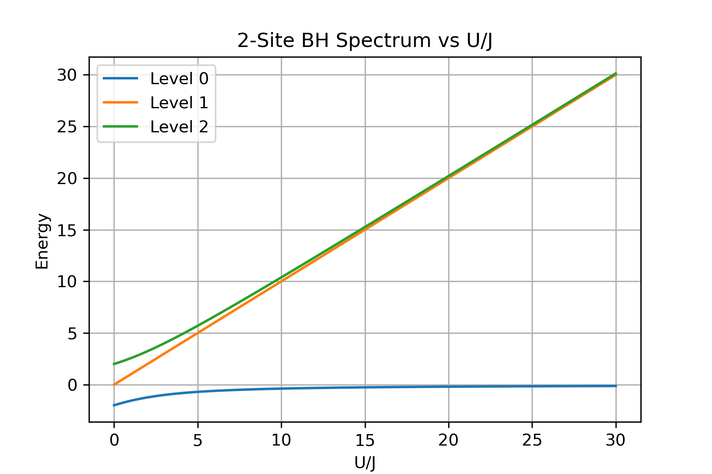
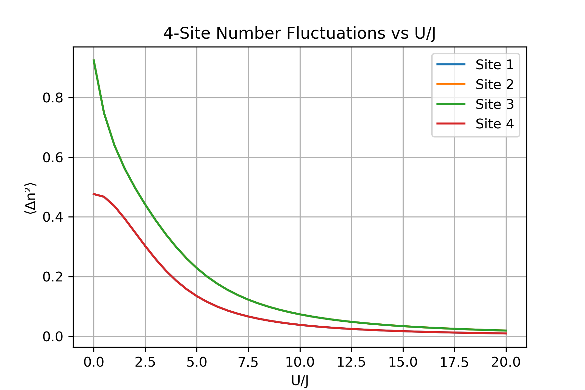

# Superfluid-Mott Insulator Transition Simulation

This simulation reproduces key features of the superfluid-Mott insulator transition in Bose-Hubbard models, inspired by the groundbreaking experiments of Bloch et al. (Nature 415, 39, 2002).

## Scientific Background

The Bose-Hubbard model describes bosonic particles in a lattice with competing kinetic and interaction energies. This simulation explores:

- Quantum phase transition between superfluid and Mott insulator states
- Competition between tunneling (J) and on-site interaction (U)
- Characteristic changes in energy spectrum and number fluctuations
- Finite-size effects in small systems amenable to exact diagonalization

## Implementation Details

The simulation uses exact diagonalization techniques to solve small Bose-Hubbard systems:

1. Two-site model (2 bosons on 2 sites):
   - Constructs the full Hamiltonian matrix in Fock basis
   - Computes energy spectrum as a function of U/J
   - Identifies ground state properties and energy gaps

2. Four-site chain (4 bosons on 4 sites):
   - Extends to a larger Hilbert space while remaining computationally tractable
   - Calculates number fluctuations ⟨n²⟩-⟨n⟩² for each site
   - Demonstrates suppression of fluctuations in the Mott regime (large U/J)

## Performance Metrics

The simulation produces two key visualizations:

- **Energy Spectrum (2-site model):**
  
  
  Shows energy level structure and gaps as a function of interaction strength

- **Number Fluctuations (4-site chain):**
  
  
  Demonstrates how particle number fluctuations are suppressed as the system transitions from superfluid to Mott insulator

## How to Run

```bash
conda activate qc-env
jupyter lab
```